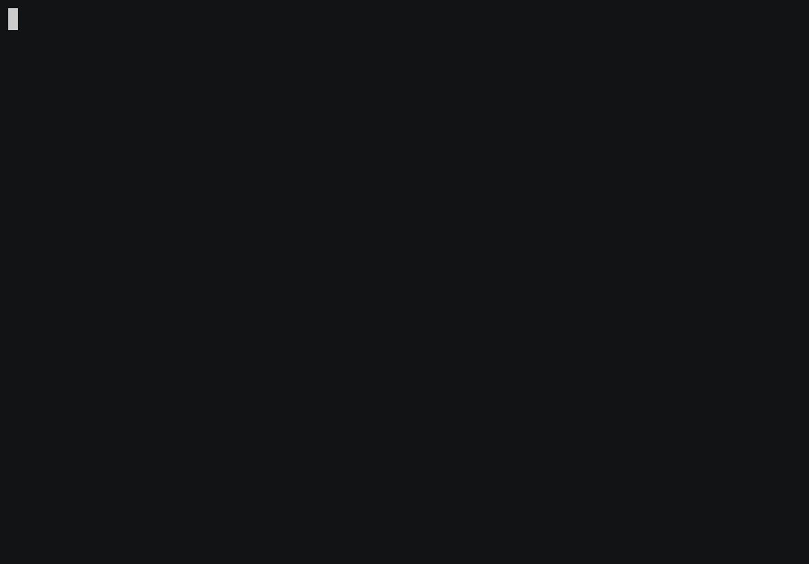

# Snake

[](https://asciinema.org/a/174483)

This was intended to try out
[ex_ncurses](https://github.com/jfreeze/ex_ncurses). Don't be disappointed if
there are bugs or if you lose.

## Running

First clone this project and do the following:

```sh
mix deps.get
iex -S mix
iex(1)> Snake.run
```

You can control the snake using the arrow keys, VI keys (hjkl), or wasd.

## Creating the demo GIF

I used [Asciinema](https://asciinema.org) to record the video and
[asciicast2gif](https://github.com/asciinema/asciicast2gif) to convert it to a
gif. Here's a rough commandline:

```sh
asciinema rec
# do stuff
# CTRL+D when done. Upload video and note video number for the next line.
docker run --rm -v $PWD:/data asciinema/asciicast2gif https://asciinema.org/a/174483.json assets/demo.gif
```

Oddly enough `asciicast2gif` loses the arena border. No idea why.
